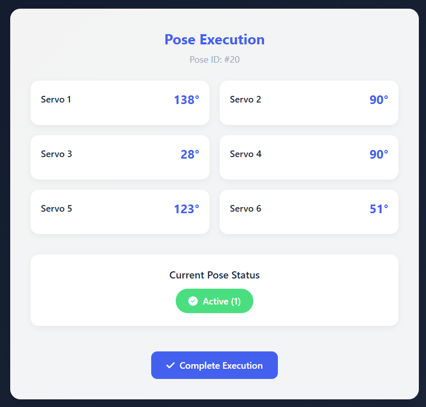
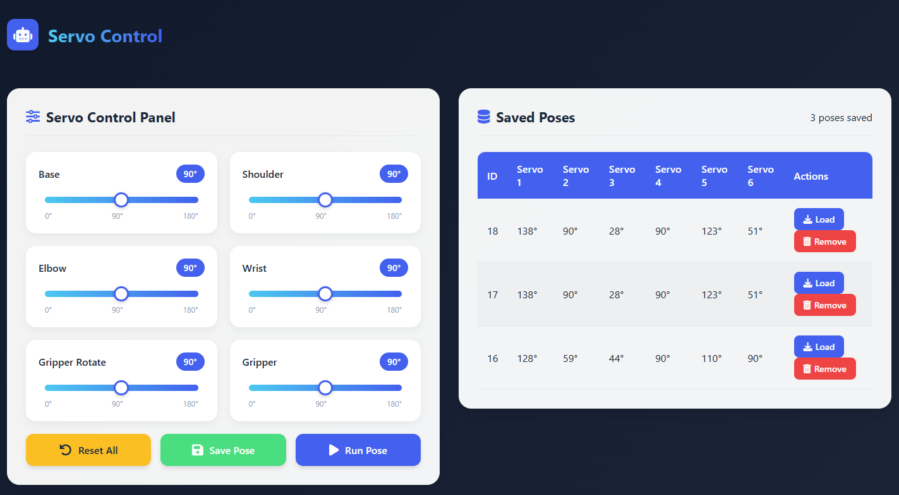

# servo_contro
A modern web application for controlling robot servos, saving poses, and executing movements

## SCREENSHOT
 

## Features
 Control 6 servos with intuitive angle sliders

💾 Save custom poses with descriptive names

🔄 Load and execute saved poses

🗑️ Delete poses when no longer needed

🔄 Reset all servos to default position

📱 Responsive design works on all devices

📊 Database storage for all poses

🔔 Interactive notifications for user feedback

## Requirements
PHP 7.4 or higher

MySQL 5.7 or higher

Web server (Apache recommended)

Modern web browser

## Usage
Adjust Servo Angles

Save a Pose

Load a Pose

Execute a Pose

Delete a Pose

## Technologies Used
Frontend:

HTML5
CSS3 
JavaScript 

Backend:

PHP 7.4+

MySQL

PDO for database access

Design:

Glass-morphism UI

Responsive layout

Smooth animations
